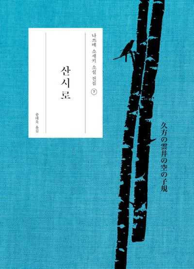

  
with random quotes from read books

  <!-- Book Instance (copy-pasted from home) -->
  

    

      
    

    

      <blockquote>
        “스트레이 십.” 미네코가 입속으로 말했다. 산시로는 그 숨결을 느낄 수 있었다.
      </blockquote>
      <blockquote>
        
          <ruby>「迷える子」<rt>ストレイ・シープ</rt></ruby>と美禰子が口の内で言った。三四郎はその<ruby>呼吸<rt>いき</rt></ruby>を感ずることができた。
           
          <cite>— 夏目漱石, <strong>三四郎</strong></cite>
        
      </blockquote>
    

  

  <!-- Add more book blocks below -->

  

    <a href="/">← Back to home</a>
  
