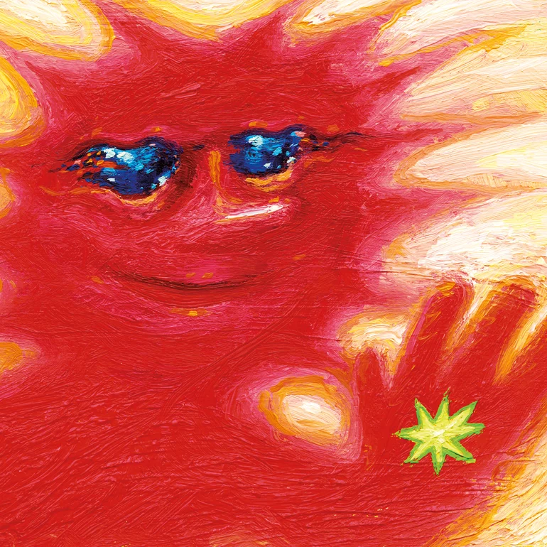

---

❧ Recent Posts

{% assign today = site.time | date: "%s" | plus: 0 %}


  
    {% assign post_date = post.date | date: "%s" | plus: 0 %}
    

      <h4>
        <a href="{{ post.url | relative_url }}">{{ post.title }}</a>
        
          NEW
        
      </h4>
      

        {{ post.date | date: "%Y-%m-%d" }}
        
          <strong>❦ Tags</strong>:
          
            <a href="/tags#{{ tag | slugify }}" class="tag">{{tag}}</a>, 
          
        
      

      
{{ post.excerpt | strip_html | truncatewords: 35 }}

    

  

---

❧ Featured Albums

  

    
    

      <h4>Luminescent Creatures - 青葉市子  </h4>
      <body><em>a deep dive into Mother Earth</em></body>
    

  

  

    
    

      <h4>Forever Howlong - Black Country, New Road</h4>
      <body><em>communal and baroque</em></body>
    

  

---

